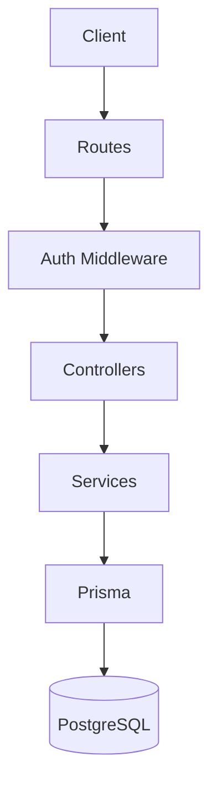
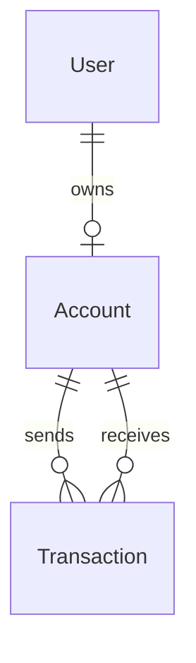

# Banking System API

Simple banking backend built with Node.js, Express, TypeScript, Prisma, and PostgreSQL.

It covers the basic backend flow of a banking system:

- user signup and login
- one account per user
- balance, deposit, withdraw, transfer
- transaction history
- admin controls
- audit logs

## How It Works



The project is split by responsibility:

- `routes` define endpoints
- `middleware` checks token and admin access
- `controllers` handle request and response
- `services` contain banking logic
- `prisma` handles database operations

## Main Parts

### Auth

Handles signup, login, password hashing, and JWT token generation.

### Account and Transactions

Each user gets one account.
The system supports:

- balance check
- deposit
- withdraw
- transfer between accounts
- transaction history

Transfer logic checks:

- valid sender
- valid receiver
- frozen account status
- sufficient balance
- same-account transfer prevention

### Admin

Admin can:

- view dashboard summary
- list users
- freeze accounts
- unfreeze accounts
- read audit logs

The admin role is assigned when signup email matches `ADMIN_EMAIL`.

## Database Design



Main models:

- `User`
- `Account`
- `Transaction`
- `AuditLog`

## Project Structure

```text
src/
  config/
  controllers/
  middleware/
  routes/
  services/
  index.ts

prisma/
  schema.prisma
  migrations/
```

## Summary

This project keeps the code simple by separating HTTP handling, auth checks, business logic, and database access.
That makes the backend easier to read, test, and extend.
