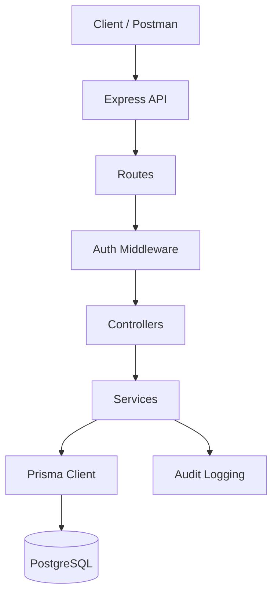

# Product Requirements Document: Banking System API

## 1. Product Overview

The Banking System API is a backend service for simple banking workflows. It allows customers to create an account, authenticate, manage basic money operations, and view transaction records. It also includes admin controls for monitoring users, freezing accounts, and viewing audit logs.

The product is designed as a clean REST API that can be used by Postman, a web frontend, a mobile app, or any HTTP client.

## 2. Goals

- Provide secure signup and login using hashed passwords and JWT authentication.
- Create one bank account automatically when a user signs up.
- Support basic account operations: balance check, deposit, withdraw, and transfer.
- Keep money updates safe using database transactions.
- Track important actions through audit logs.
- Give admins basic control over users and accounts.
- Keep the codebase simple, readable, and easy to extend.

## 3. Non-Goals

- This is not a real production banking platform.
- It does not integrate with payment gateways, UPI, cards, KYC, SMS, or email.
- It does not implement multi-account-per-user banking.
- It does not implement loan, interest, statements, reconciliation, or settlement systems.
- It does not include a frontend dashboard.

## 4. Users

### Customer

A normal user who can:

- sign up
- log in
- view profile
- check balance
- deposit money
- withdraw money
- transfer money
- view transaction history

### Admin

A privileged user who can:

- view dashboard summary
- view all users
- freeze accounts
- unfreeze accounts
- view audit logs

Admin access is assigned when the signup email matches the `ADMIN_EMAIL` environment variable.

## 5. Main User Flows

### 5.1 Customer Signup

1. Customer sends name, email, password, and optional phone.
2. API validates input using Zod.
3. API checks if email already exists.
4. Password is hashed using bcrypt.
5. User is created in PostgreSQL.
6. A bank account is created for the user.
7. API returns user data and JWT token.

### 5.2 Customer Login

1. Customer sends email and password.
2. API validates input.
3. API finds user by email.
4. bcrypt compares password with stored password hash.
5. API returns user data and JWT token.

### 5.3 Money Deposit

1. Customer sends amount and optional note.
2. API checks JWT token.
3. API checks account is not frozen.
4. Account balance is incremented.
5. A credit transaction is created.
6. Audit log is created.

### 5.4 Money Withdraw

1. Customer sends amount and optional note.
2. API checks JWT token.
3. API checks account is not frozen.
4. API checks sufficient balance.
5. Account balance is decremented.
6. A debit transaction is created.
7. Audit log is created.

### 5.5 Money Transfer

1. Sender sends receiver account number, amount, and optional note.
2. API checks JWT token.
3. API checks sender account exists and is not frozen.
4. API checks receiver account exists and is not frozen.
5. API blocks same-account transfer.
6. API checks sufficient balance.
7. Sender balance is decremented.
8. Receiver balance is incremented.
9. Transfer transaction is created.
10. Audit log is created.

### 5.6 Admin Account Freeze

1. Admin sends account number.
2. API checks JWT token.
3. API verifies user role is `ADMIN`.
4. Account `isFrozen` is updated.
5. Audit log is created.

## 6. Feature List

| Feature | Status | Description |
| --- | --- | --- |
| Signup | Implemented | Creates user and account |
| Login | Implemented | Returns JWT token |
| JWT Auth | Implemented | Protects user and admin routes |
| Admin Guard | Implemented | Restricts admin APIs |
| Balance Check | Implemented | Returns current account |
| Deposit | Implemented | Adds money and creates credit transaction |
| Withdraw | Implemented | Deducts money and creates debit transaction |
| Transfer | Implemented | Moves money between accounts |
| Audit Logs | Implemented | Logs deposit, withdraw, transfer, freeze, unfreeze |
| Account Freeze | Implemented | Blocks operations on frozen accounts |
| Swagger JSON | Implemented | Exposes OpenAPI JSON at `/swagger.json` |
| Pagination | Not implemented in current code | Transaction history currently returns full list |
| Idempotency | Not implemented in current code | No idempotency key exists in current schema |
| Transaction Analytics | Partial | Dashboard includes counts and total balance; no dedicated analytics route |

## 7. API Surface

### Public

- `GET /`
- `GET /health`
- `GET /swagger.json`

### Auth

- `POST /api/auth/signup`
- `POST /api/auth/register`
- `POST /api/auth/login`

### Customer

- `GET /api/users/me`
- `GET /api/transactions/balance`
- `POST /api/transactions/deposit`
- `POST /api/transactions/withdraw`
- `POST /api/transactions/transfer`
- `GET /api/transactions/history`

### Admin

- `GET /api/admin/dashboard`
- `GET /api/admin/users`
- `GET /api/admin/audit-logs`
- `PATCH /api/admin/accounts/:accountNumber/freeze`
- `PATCH /api/admin/accounts/:accountNumber/unfreeze`

## 8. Product Principles

- Keep core banking logic easy to understand.
- Validate all external input.
- Never store plain-text passwords.
- Use JWT only for authentication, not as the source of truth for authorization.
- Read the latest user role from the database for admin access.
- Use database transactions for balance-changing operations.
- Keep routes, controllers, services, and database access separate.

## 9. Success Criteria

- A user can sign up and receive a token.
- A user can log in with the correct password.
- A user cannot access protected routes without a token.
- A user can deposit, withdraw, transfer, and view history.
- A frozen account cannot perform money operations.
- Admin can freeze and unfreeze accounts.
- Audit logs are created for important money/admin actions.
- Project builds successfully with TypeScript.

## 10. High-Level Architecture

