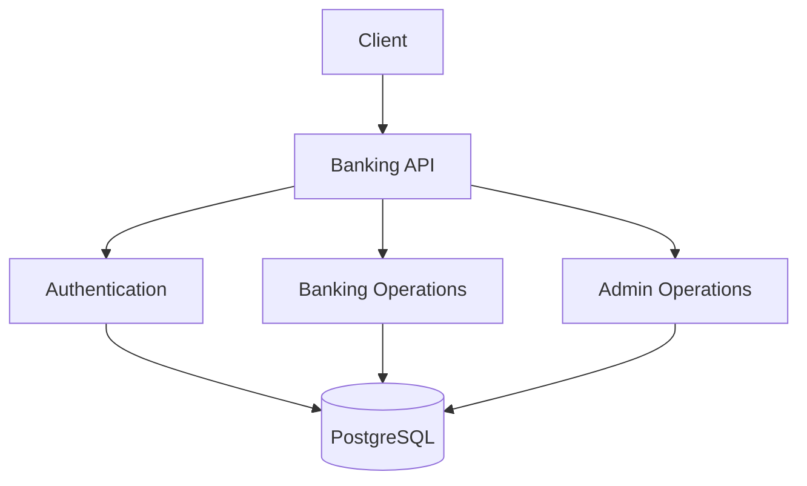
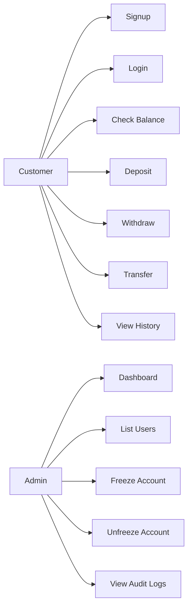

# Software Requirements Specification: Banking System API

## 1. Introduction

### 1.1 Purpose

This SRS defines the functional and non-functional requirements for the Banking System API. It describes what the system must do, how users interact with it, what constraints exist, and what quality expectations the implementation must satisfy.

### 1.2 Scope

The system is a REST API for basic banking operations:

- user authentication
- account creation
- deposits
- withdrawals
- transfers
- transaction history
- admin account controls
- audit logging

### 1.3 Intended Audience

- Backend developers
- Reviewers
- Testers
- Project evaluators
- Future maintainers

## 2. Overall Description

### 2.1 Product Perspective

The Banking System API is a standalone backend service. It uses PostgreSQL for persistent storage and exposes REST endpoints for clients.



### 2.2 User Classes

#### Customer

The customer is a normal authenticated user. The customer can manage their own account and transactions.

#### Admin

The admin can view system-level data and freeze or unfreeze accounts.

### 2.3 Operating Environment

- Node.js runtime
- PostgreSQL database
- Windows/Linux/macOS development environment
- HTTP client such as Postman

### 2.4 Assumptions

- PostgreSQL is running and reachable through `DATABASE_URL`.
- Prisma migrations are applied.
- `JWT_SECRET` is configured.
- `ADMIN_EMAIL` is configured when admin access is needed.

## 3. Functional Requirements

### FR-1 Signup

The system shall allow a user to sign up with name, email, password, and optional phone.

Acceptance criteria:

- Invalid input returns `400`.
- Duplicate email returns error.
- Password is stored as hash.
- Account is created with the user.
- Token is returned after signup.

### FR-2 Login

The system shall allow a user to log in with email and password.

Acceptance criteria:

- Invalid credentials return error.
- Correct credentials return JWT token.
- Token contains user id, email, and role.

### FR-3 Authentication

The system shall protect customer and admin APIs using JWT.

Acceptance criteria:

- Missing token returns `401`.
- Invalid token returns `401`.
- Valid token loads user from database.

### FR-4 Admin Authorization

The system shall restrict admin APIs to users with role `ADMIN`.

Acceptance criteria:

- Non-admin users receive `403`.
- Admin users can access admin endpoints.
- Role is checked from database.

### FR-5 Profile

The system shall allow authenticated users to view their profile.

Acceptance criteria:

- Response includes user data.
- Response includes linked account data.

### FR-6 Balance

The system shall allow authenticated users to view their account balance.

Acceptance criteria:

- Account must exist.
- Frozen account returns error because account access uses the same account guard.

### FR-7 Deposit

The system shall allow authenticated users to deposit money.

Acceptance criteria:

- Amount must be positive.
- Account must not be frozen.
- Balance increases by amount.
- Credit transaction is created.
- Audit log is created.

### FR-8 Withdraw

The system shall allow authenticated users to withdraw money.

Acceptance criteria:

- Amount must be positive.
- Account must not be frozen.
- Balance must be sufficient.
- Balance decreases by amount.
- Debit transaction is created.
- Audit log is created.

### FR-9 Transfer

The system shall allow authenticated users to transfer money to another account.

Acceptance criteria:

- Receiver account must exist.
- Sender account must not be frozen.
- Receiver account must not be frozen.
- Sender and receiver account must be different.
- Sender balance must be sufficient.
- Sender balance decreases.
- Receiver balance increases.
- Transaction is created.
- Audit log is created.

### FR-10 Transaction History

The system shall allow authenticated users to view transactions involving their account.

Acceptance criteria:

- Transactions are sorted newest first.
- Sent and received transactions are included.

### FR-11 Admin Dashboard

The system shall provide dashboard summary for admins.

Acceptance criteria:

- Response includes user count.
- Response includes account count.
- Response includes transaction count.
- Response includes total balance.

### FR-12 Admin User List

The system shall allow admins to list users.

Acceptance criteria:

- Users are returned with account information.
- Latest users appear first.

### FR-13 Account Freeze

The system shall allow admins to freeze an account.

Acceptance criteria:

- Account `isFrozen` becomes `true`.
- Audit log is created.
- Frozen account cannot deposit, withdraw, or transfer.

### FR-14 Account Unfreeze

The system shall allow admins to unfreeze an account.

Acceptance criteria:

- Account `isFrozen` becomes `false`.
- Audit log is created.
- Account can perform operations again.

### FR-15 Audit Logs

The system shall store important actions in audit logs.

Acceptance criteria:

- Deposit creates audit log.
- Withdraw creates audit log.
- Transfer creates audit log.
- Freeze creates audit log.
- Unfreeze creates audit log.

### FR-16 Swagger JSON

The system shall expose OpenAPI JSON.

Acceptance criteria:

- `GET /swagger.json` returns OpenAPI object.

## 4. Non-Functional Requirements

### NFR-1 Security

- Passwords must never be stored in plain text.
- JWT secret must come from environment configuration.
- Admin authorization must be enforced server-side.

### NFR-2 Reliability

- Money-changing operations must use database transactions.
- API must return consistent error responses.
- Database constraints must enforce unique email and account number.

### NFR-3 Maintainability

- Code must stay separated into routes, controllers, services, middleware, and config.
- Business logic must stay in services.
- Controllers must stay thin.

### NFR-4 Performance

- Database connection pooling must be used.
- Common operations should use indexed fields such as email and account number.

### NFR-5 Usability

- API should be easy to test through Postman.
- Errors should be clear enough for debugging.
- README and docs should explain setup and usage.

## 5. External Interface Requirements

### 5.1 HTTP Interface

The API uses JSON request and response bodies.

Headers for protected endpoints:

```text
Authorization: Bearer <token>
```

### 5.2 Database Interface

The API communicates with PostgreSQL through Prisma Client.

### 5.3 Configuration Interface

Configuration is provided through `.env`.

## 6. Data Requirements

### User Data

- name
- email
- phone
- password hash
- role

### Account Data

- account number
- account type
- balance
- freeze status

### Transaction Data

- amount
- type
- note
- sender account
- receiver account
- timestamp

### Audit Data

- user id
- action
- details
- timestamp

## 7. Business Rules

- One user owns one account.
- Email must be unique.
- Account number must be unique.
- Password must be hashed.
- Frozen accounts cannot perform money operations.
- Withdraw and transfer require sufficient balance.
- A user cannot transfer money to the same account.
- Admin role is assigned through `ADMIN_EMAIL`.

## 8. Use Case Diagram



## 9. Acceptance Test Checklist

- Signup creates user and account.
- Login returns token.
- Protected route rejects missing token.
- Profile returns current user.
- Deposit increases balance.
- Withdraw decreases balance.
- Transfer moves money between accounts.
- Insufficient balance returns error.
- Frozen account blocks operations.
- Admin can freeze and unfreeze account.
- Audit logs are created.
- TypeScript build passes.

## 10. Known Gaps

- No frontend is included.
- No automated test suite is included.
- No idempotency key exists for transfer.
- No paginated history endpoint exists yet.
- No dedicated analytics endpoint exists beyond dashboard summary.
